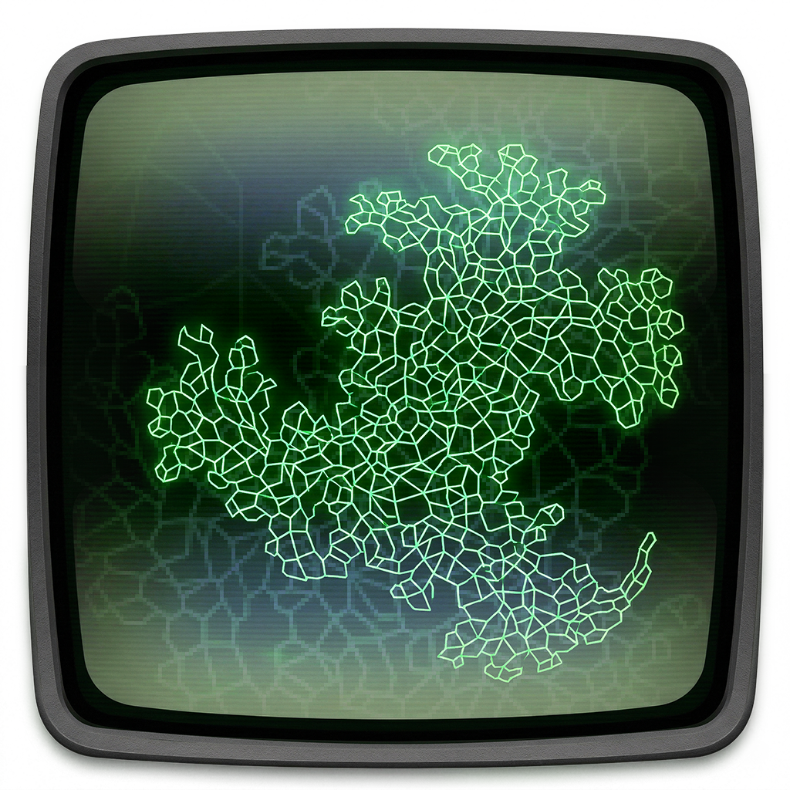

# LICHEN: A LIveCoding Historical ENvironment for the GRASS Language.
LICHEN (LIveCoding Historical ENvironment) is a JavaScript implementation of the pioneering GRASS (GRAphics Symbiosis System) livecoding language developed by Tom DiFanti starting in 1973&mdash;placed in its historical context as a scriptable video source for the Sandin Image Processor hardware analog effects system, by Dan Sandin and Phil Morton. The Sandin hardware is also recreated by LICHEN, using a JS port of an emulation project by <a href="https://github.com/amandalong">@amandalong</a>. 
 

