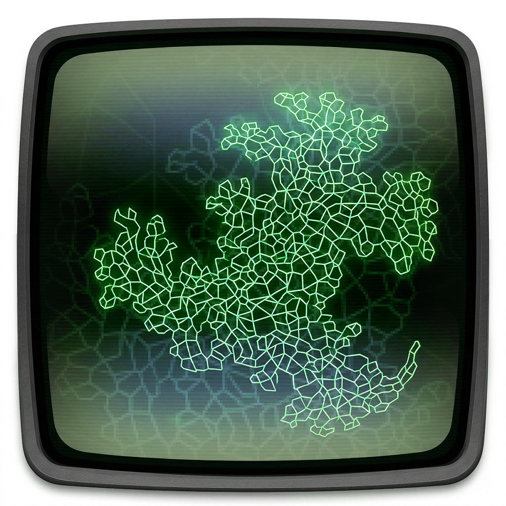

# LICHEN: A LIveCoding Historical ENvironment for the GRASS Language.
LICHEN (LIveCoding Historical ENvironment) is a p5.js-based modular patch system for making retrocomputer visual art projects talk to each other. This evolving collection of modules started as an effort to place GRASS (GRAphics Symbiosis System), a pioneering livecoding language by Tom DiFanti, in its original historical context. A PDP-11 running GRASS was used as a scriptable video source for the Sandin Image Processor hardware analog effects system by Dan Sandin and Phil Morton, here using a port of an emulation project by <a href="https://github.com/amandalong">@amandalong</a>. 
 

